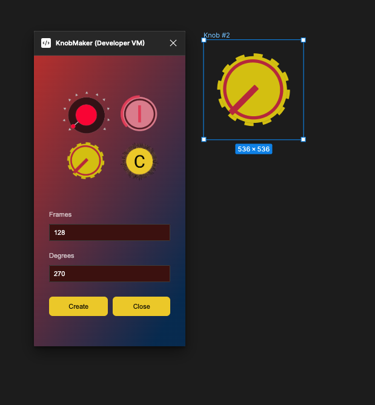

### How to use:

1. Create Frame
2. Frame should contain at least two children: "Center" and "Rotating Pointer"
3. Open Plugin -> Specify #frames and #degrees

[Link to video](./video_instruction.mp4)